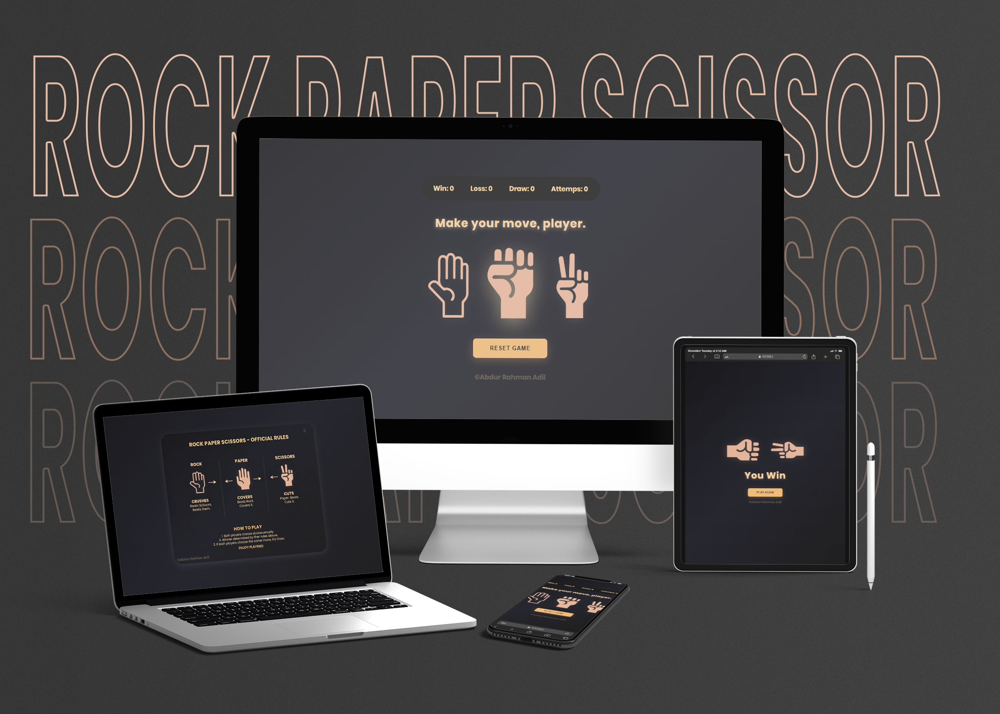

# Rock Paper Scissors Game

A beautifully designed, interactive Rock Paper Scissors game built with vanilla JavaScript, HTML, and CSS. Features smooth animations, a sleek dark theme with golden accents, and a comprehensive scoring system.


### Game Interface

*Rock, Paper, Scissors*


## Features

### Game Mechanics
- **Classic gameplay**: Play Rock, Paper, Scissors against the computer
- **Random AI opponent**: Computer makes random choices for fair gameplay
- **Score tracking**: Tracks wins, losses, draws, and total attempts
- **Persistent statistics**: View your performance across multiple rounds

### User Interface
- **Rules popup**: Introductory modal displaying game rules (can be dismissed)
- **Animated battles**: Smooth shake animations when hands collide
- **Responsive design**: Works seamlessly on desktop, tablet, and mobile devices
- **Visual feedback**: Hover effects and drop shadows for better interactivity
- **Modern aesthetic**: Dark gradient background with warm golden color scheme

### Interactive Elements
- **Play Again button**: Quickly start a new round without losing statistics
- **Reset Game button**: Clear all scores and start fresh
- **Visual indicators**: Real-time score updates after each round
- **Smooth transitions**: Fade-in and pop-up animations throughout

## Technology Stack

- **HTML5**: Semantic markup structure
- **CSS3**: Advanced animations, gradients, and responsive design
- **Vanilla JavaScript**: Pure JavaScript with no dependencies
- **Google Fonts**: Poppins font family for modern typography

## File Structure

```
project/
│
├── index.html          # Main HTML structure
├── css/
│   └── style.css       # All styling and animations
├── js/
│   └── script.js       # Game logic and interactivity
└── assets/
    ├── rock.png        # Rock hand image
    ├── paper.png       # Paper hand image
    ├── sizzer.png      # Scissors hand image
    └── rulesPopUp.png  # Rules popup image
    |__ mockup.jpg      # Full Website preview 
```

## How to Play

1. **Start**: Click the 'X' button to dismiss the rules popup
2. **Choose**: Click on Rock, Paper, or Scissors
3. **Watch**: Animated hands will shake and reveal the result
4. **Results**: 
   - Rock beats Scissors
   - Paper beats Rock
   - Scissors beats Paper
   - Same choice results in a draw
5. **Continue**: Click "Play Again" for another round
6. **Reset**: Click "Reset Game" to clear all statistics

## Game Logic

### Win Conditions
```javascript
Paper beats Rock
Scissors beats Paper
Rock beats Scissors
Same choice = Draw
```

### Score Display
- **Win**: Increments when player wins
- **Loss**: Increments when computer wins
- **Draw**: Increments when both choose the same
- **Attempts**: Total number of rounds played

## Styling Highlights

### Color Palette
- **Background**: Dark gradient (#1a1a1d, #27272f, #1f1f1f)
- **Primary accent**: Golden (#f4d3a1, #f0bb7a)
- **Text**: Warm cream (#f4d3a1)
- **Buttons**: Golden orange (#f0bb7a)

### Animations
- **shakeLeft**: Left hand shaking animation (1.4s)
- **shakeRight**: Right hand shaking animation (1.4s)
- **popUp**: Modal entrance animation (0.4s)
- **fadeIn**: Smooth fade-in effect (0.6s)

### Responsive Breakpoints
- **Desktop**: Full experience with max-width 600px modal
- **Tablet**: Adjusted modal positioning (max-width: 600px)
- **Mobile**: Optimized layout (max-width: 400px)

## Browser Compatibility

- Chrome (recommended)
- Firefox
- Safari
- Edge
- Opera

Modern browsers with ES6 support required.

## Installation

1. Clone or download the project files
2. Ensure all assets are in the `assets/` folder
3. Open `index.html` in your web browser
4. No build process or dependencies required!

## Customization

### Change Hand Images
Replace images in the `assets/` folder with your own PNG files (maintain naming convention).

### Modify Colors
Edit CSS custom properties in `style.css`:
```css
/* Example color modifications */
background: linear-gradient(135deg, #yourcolor1, #yourcolor2);
color: #yourtextcolor;
```

### Adjust Animation Speed
Modify animation durations in CSS:
```css
animation: shakeLeft 1.4s ease forwards; /* Change 1.4s */
```

## Known Issues

- No persistent storage (scores reset on page reload)
- Rules popup image must be provided by user
- No sound effects (can be added via JavaScript)

## Future Enhancements

- [ ] Add sound effects for actions
- [ ] Implement local storage for score persistence
- [ ] Add difficulty levels (AI patterns)
- [ ] Include game history log
- [ ] Add multiplayer mode
- [ ] Create tournament mode
- [ ] Add achievements system
- [ ] Implement dark/light theme toggle

## Credits

**Developer**: Abdur Rahman Adil

**Font**: Poppins (Google Fonts)

## License

This project is open source and available for personal and educational use.

---

**Enjoy the game!** 🎮✨